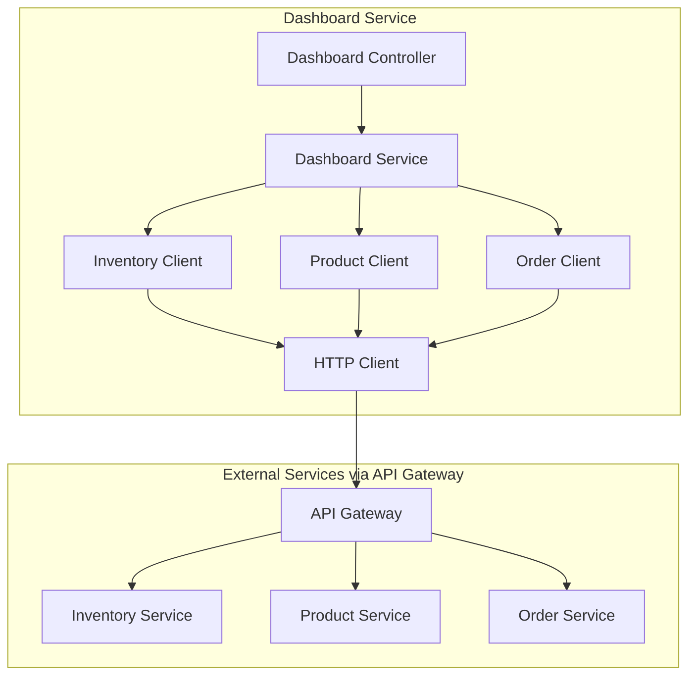
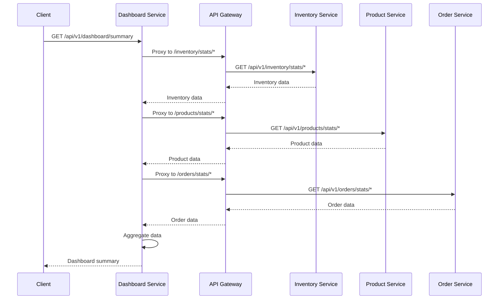

# Dashboard Service Architecture Design

## Executive Summary

The Dashboard Service is a centralized aggregation service designed to provide a unified view of business metrics across the CloudRetail platform. It aggregates data from three existing microservices (Inventory, Product, and Order Services) and delivers consolidated dashboard statistics for real-time business monitoring.

## 1. Folder Structure

```
dashboard-service/
├── .env.example
├── .gitignore
├── Dockerfile
├── package.json
├── logs/
│   └── .gitkeep
└── src/
    ├── server.js
    ├── config/
    │   └── database.js
    ├── controllers/
    │   └── dashboard.controller.js
    ├── services/
    │   ├── dashboard.service.js
    │   ├── inventory.client.js
    │   ├── product.client.js
    │   └── order.client.js
    ├── routes/
    │   └── dashboard.routes.js
    ├── middlewares/
    │   └── error.middleware.js
    ├── utils/
    │   └── logger.js
    └── clients/
        ├── http-client.js
        └── service-endpoints.js
```

## 2. Service Architecture Overview



## 3. API Endpoints Design

### 3.1 Main Dashboard Endpoints

| Method | Endpoint | Description | Auth Required |
|--------|----------|-------------|----------------|
| GET | `/api/v1/dashboard/summary` | Get comprehensive dashboard summary | Yes |
| GET | `/api/v1/dashboard/metrics` | Get aggregated metrics | Yes |
| GET | `/api/v1/dashboard/inventory` | Get inventory statistics | Yes |
| GET | `/api/v1/dashboard/products` | Get product statistics | Yes |
| GET | `/api/v1/dashboard/orders` | Get order statistics | Yes |
| GET | `/api/v1/dashboard/health` | Service health check | No |

### 3.2 Response Format

**Dashboard Summary Response:**
```json
{
  "success": true,
  "data": {
    "timestamp": "2024-01-15T10:30:00.000Z",
    "summary": {
      "totalProducts": 150,
      "totalOrders": 1250,
      "totalRevenue": 45678.90,
      "lowStockItems": 12,
      "pendingOrders": 45,
      "todayOrders": 23,
      "todayRevenue": 1250.00
    },
    "inventory": {
      "totalStock": 5000,
      "lowStockCount": 12,
      "outOfStockCount": 3
    },
    "products": {
      "totalProducts": 150,
      "categories": 8,
      "activeProducts": 145,
      "inactiveProducts": 5
    },
    "orders": {
      "totalOrders": 1250,
      "pendingOrders": 45,
      "completedOrders": 1100,
      "cancelledOrders": 105,
      "averageOrderValue": 36.54
    }
  }
}
```

## 4. Service Layer Design

### 4.1 Dashboard Service ([`dashboard.service.js`](src/services/dashboard.service.js))

The main service orchestrates data aggregation from multiple service clients:

```javascript
class DashboardService {
  // Main method to aggregate all dashboard data
  async getDashboardSummary(options = {}) {
    // Parallel execution of all data fetches
    const [inventoryStats, productStats, orderStats] = await Promise.all([
      this.getInventoryMetrics(),
      this.getProductMetrics(),
      this.getOrderMetrics()
    ]);
    
    return this.aggregateMetrics(inventoryStats, productStats, orderStats);
  }
  
  async getInventoryMetrics() {
    const [stockLevels, lowStock, outOfStock] = await Promise.all([
      this.inventoryClient.getStockSummary(),
      this.inventoryClient.getLowStockItems({ limit: 10 }),
      this.inventoryClient.getOutOfStockItems()
    ]);
    
    return {
      totalStock: stockLevels.totalQuantity,
      lowStockCount: lowStock.count,
      outOfStockCount: outOfStock.count,
      lowStockItems: lowStock.items,
      warehouseDistribution: stockLevels.byWarehouse
    };
  }
  
  async getProductMetrics() {
    const [products, categories] = await Promise.all([
      this.productClient.getAllProducts({ limit: 1 }), // Just count
      this.productClient.getCategories()
    ]);
    
    return {
      totalProducts: products.count,
      categoryCount: categories.length,
      activeProducts: products.activeCount,
      inactiveProducts: products.inactiveCount,
      categoryDistribution: categories.distribution
    };
  }
  
  async getOrderMetrics() {
    const [orders, todayOrders, revenue] = await Promise.all([
      this.orderClient.getAllOrders({ limit: 1 }),
      this.orderClient.getTodayOrders(),
      this.orderClient.getRevenueMetrics()
    ]);
    
    return {
      totalOrders: orders.count,
      pendingOrders: orders.pendingCount,
      completedOrders: orders.completedCount,
      cancelledOrders: orders.cancelledCount,
      todayOrders: todayOrders.count,
      todayRevenue: todayOrders.revenue,
      totalRevenue: revenue.total,
      averageOrderValue: revenue.average
    };
  }
}
```

### 4.2 Service Clients

#### Inventory Client ([`inventory.client.js`](src/services/inventory.client.js))
```javascript
class InventoryClient {
  constructor(httpClient) {
    this.httpClient = httpClient;
    this.baseUrl = process.env.INVENTORY_SERVICE_URL || 'http://inventory-service:3004';
  }
  
  async getStockSummary() {
    return this.httpClient.get(`${this.baseUrl}/api/v1/inventory/stats/summary`);
  }
  
  async getLowStockItems(options = {}) {
    return this.httpClient.get(`${this.baseUrl}/api/v1/inventory/stats/low-stock`, { params: options });
  }
  
  async getOutOfStockItems() {
    return this.httpClient.get(`${this.baseUrl}/api/v1/inventory/stats/out-of-stock`);
  }
  
  async getStockByWarehouse() {
    return this.httpClient.get(`${this.baseUrl}/api/v1/inventory/stats/by-warehouse`);
  }
}
```

#### Product Client ([`product.client.js`](src/services/product.client.js))
```javascript
class ProductClient {
  constructor(httpClient) {
    this.httpClient = httpClient;
    this.baseUrl = process.env.PRODUCT_SERVICE_URL || 'http://product-service:3002';
  }
  
  async getAllProducts(options = {}) {
    return this.httpClient.get(`${this.baseUrl}/api/v1/products`, { params: options });
  }
  
  async getCategories() {
    return this.httpClient.get(`${this.baseUrl}/api/v1/products/categories`);
  }
  
  async getProductStats() {
    return this.httpClient.get(`${this.baseUrl}/api/v1/products/stats`);
  }
  
  async getTopProducts(limit = 10) {
    return this.httpClient.get(`${this.baseUrl}/api/v1/products/top`, { params: { limit } });
  }
}
```

#### Order Client ([`order.client.js`](src/services/order.client.js))
```javascript
class OrderClient {
  constructor(httpClient) {
    this.httpClient = httpClient;
    this.baseUrl = process.env.ORDER_SERVICE_URL || 'http://order-service:3003';
  }
  
  async getAllOrders(options = {}) {
    return this.httpClient.get(`${this.baseUrl}/api/v1/orders/all`, { params: options });
  }
  
  async getTodayOrders() {
    const today = new Date().toISOString().split('T')[0];
    return this.httpClient.get(`${this.baseUrl}/api/v1/orders`, { 
      params: { dateFrom: today, dateTo: today } 
    });
  }
  
  async getRevenueMetrics(options = {}) {
    return this.httpClient.get(`${this.baseUrl}/api/v1/orders/stats/revenue`, { params: options });
  }
  
  async getRecentOrders(limit = 10) {
    return this.httpClient.get(`${this.baseUrl}/api/v1/orders/recent`, { params: { limit } });
  }
  
  async getOrderStatusDistribution() {
    return this.httpClient.get(`${this.baseUrl}/api/v1/orders/stats/by-status`);
  }
}
```

## 5. Controller Layer Design

### 5.1 Dashboard Controller ([`dashboard.controller.js`](src/controllers/dashboard.controller.js))

```javascript
class DashboardController {
  constructor(dashboardService) {
    this.dashboardService = dashboardService;
  }
  
  // GET /dashboard/summary
  async getSummary(req, res, next) {
    try {
      const { period = 'all', warehouseId } = req.query;
      
      const summary = await this.dashboardService.getDashboardSummary({
        period,
        warehouseId,
        includeCharts: true
      });
      
      res.json({
        success: true,
        timestamp: new Date().toISOString(),
        data: summary
      });
    } catch (error) {
      next(error);
    }
  }
  
  // GET /dashboard/metrics
  async getMetrics(req, res, next) {
    try {
      const { type = 'all', dateFrom, dateTo } = req.query;
      
      const metrics = await this.dashboardService.getMetrics({
        type,
        dateFrom,
        dateTo
      });
      
      res.json({
        success: true,
        timestamp: new Date().toISOString(),
        data: metrics
      });
    } catch (error) {
      next(error);
    }
  }
  
  // GET /dashboard/inventory
  async getInventoryStats(req, res, next) {
    try {
      const stats = await this.dashboardService.getInventoryStats(req.query);
      
      res.json({
        success: true,
        timestamp: new Date().toISOString(),
        data: stats
      });
    } catch (error) {
      next(error);
    }
  }
  
  // GET /dashboard/products
  async getProductStats(req, res, next) {
    try {
      const stats = await this.dashboardService.getProductStats(req.query);
      
      res.json({
        success: true,
        timestamp: new Date().toISOString(),
        data: stats
      });
    } catch (error) {
      next(error);
    }
  }
  
  // GET /dashboard/orders
  async getOrderStats(req, res, next) {
    try {
      const stats = await this.dashboardService.getOrderStats(req.query);
      
      res.json({
        success: true,
        timestamp: new Date().toISOString(),
        data: stats
      });
    } catch (error) {
      next(error);
    }
  }
  
  // GET /dashboard/health
  async healthCheck(req, res) {
    const serviceHealth = await this.dashboardService.checkServiceHealth();
    
    const allHealthy = Object.values(serviceHealth).every(s => s.status === 'healthy');
    
    res.status(allHealthy ? 200 : 503).json({
      status: allHealthy ? 'healthy' : 'degraded',
      service: 'dashboard-service',
      timestamp: new Date().toISOString(),
      dependencies: serviceHealth
    });
  }
}
```

## 6. Routes Definition

### 6.1 Dashboard Routes ([`dashboard.routes.js`](src/routes/dashboard.routes.js))

```javascript
const express = require('express');
const dashboardController = require('../controllers/dashboard.controller');
const { authenticate, requireAdmin } = require('../middlewares/auth.middleware');

const router = express.Router();

// Health check (public)
router.get('/health', dashboardController.healthCheck.bind(dashboardController));

// All dashboard routes require authentication
router.use(authenticate);

// Dashboard summary (admin only for full access)
router.get('/summary', requireAdmin, dashboardController.getSummary.bind(dashboardController));

// Metrics endpoints
router.get('/metrics', dashboardController.getMetrics.bind(dashboardController));
router.get('/inventory', dashboardController.getInventoryStats.bind(dashboardController));
router.get('/products', dashboardController.getProductStats.bind(dashboardController));
router.get('/orders', dashboardController.getOrderStats.bind(dashboardController));

module.exports = router;
```

## 7. Data Models

The Dashboard Service is primarily an aggregation layer and does not maintain its own database. However, it may cache aggregated data for performance.

### 7.1 Cached Data Structures

**Dashboard Cache Key Structure:**
- `dashboard:summary:{period}` - Cached summary data
- `dashboard:inventory:{warehouseId}` - Inventory stats by warehouse
- `dashboard:orders:{date}` - Daily order stats
- `dashboard:products:{category}` - Product stats by category

### 7.2 Response DTOs

```typescript
// DashboardSummary DTO
interface DashboardSummary {
  timestamp: string;
  summary: {
    totalProducts: number;
    totalOrders: number;
    totalRevenue: number;
    lowStockItems: number;
    pendingOrders: number;
    todayOrders: number;
    todayRevenue: number;
  };
  inventory: InventoryMetrics;
  products: ProductMetrics;
  orders: OrderMetrics;
}

// InventoryMetrics DTO
interface InventoryMetrics {
  totalStock: number;
  lowStockCount: number;
  outOfStockCount: number;
  lowStockItems: Array<{
    id: string;
    sku: string;
    productName: string;
    quantity: number;
    minimumStock: number;
  }>;
  warehouseDistribution: Array<{
    warehouseId: string;
    warehouseName: string;
    totalStock: number;
    itemCount: number;
  }>;
}

// ProductMetrics DTO
interface ProductMetrics {
  totalProducts: number;
  categoryCount: number;
  activeProducts: number;
  inactiveProducts: number;
  categoryDistribution: Array<{
    category: string;
    productCount: number;
  }>;
}

// OrderMetrics DTO
interface OrderMetrics {
  totalOrders: number;
  pendingOrders: number;
  completedOrders: number;
  cancelledOrders: number;
  averageOrderValue: number;
  recentOrders: Array<{
    id: string;
    orderNumber: string;
    totalAmount: number;
    status: string;
    createdAt: string;
  }>;
}
```

## 8. Service Dependencies & Communication

### 8.1 Communication Pattern

The Dashboard Service communicates with existing services via HTTP through the API Gateway:



### 8.2 HTTP Client Configuration ([`http-client.js`](src/clients/http-client.js))

```javascript
const axios = require('axios');

class HttpClient {
  constructor(baseURL, options = {}) {
    this.client = axios.create({
      baseURL,
      timeout: options.timeout || 10000,
      headers: {
        'Content-Type': 'application/json',
        ...options.headers
      }
    });
    
    // Request interceptor for adding auth token
    this.client.interceptors.request.use(
      (config) => {
        const token = process.env.SERVICE_API_KEY;
        if (token) {
          config.headers.Authorization = `Bearer ${token}`;
        }
        return config;
      },
      (error) => Promise.reject(error)
    );
    
    // Response interceptor for error handling
    this.client.interceptors.response.use(
      (response) => response.data,
      (error) => {
        const message = error.response?.data?.message || error.message;
        const status = error.response?.status || 500;
        throw new Error(`Service call failed: ${message} (Status: ${status})`);
      }
    );
  }
  
  async get(url, options = {}) {
    return this.client.get(url, options);
  }
  
  async post(url, data, options = {}) {
    return this.client.post(url, data, options);
  }
}

module.exports = HttpClient;
```

### 8.3 Service Endpoints Configuration ([`service-endpoints.js`](src/clients/service-endpoints.js))

```javascript
module.exports = {
  inventory: {
    baseUrl: process.env.INVENTORY_SERVICE_URL || 'http://inventory-service:3004',
    healthPath: '/health',
    endpoints: {
      stats: '/api/v1/inventory/stats',
      lowStock: '/api/v1/inventory/stats/low-stock',
      outOfStock: '/api/v1/inventory/stats/out-of-stock',
      byWarehouse: '/api/v1/inventory/stats/by-warehouse'
    }
  },
  product: {
    baseUrl: process.env.PRODUCT_SERVICE_URL || 'http://product-service:3002',
    healthPath: '/health',
    endpoints: {
      products: '/api/v1/products',
      categories: '/api/v1/products/categories',
      stats: '/api/v1/products/stats',
      top: '/api/v1/products/top'
    }
  },
  order: {
    baseUrl: process.env.ORDER_SERVICE_URL || 'http://order-service:3003',
    healthPath: '/health',
    endpoints: {
      orders: '/api/v1/orders',
      allOrders: '/api/v1/orders/all',
      recent: '/api/v1/orders/recent',
      stats: {
        revenue: '/api/v1/orders/stats/revenue',
        byStatus: '/api/v1/orders/stats/by-status'
      }
    }
  }
};
```

## 9. Configuration Requirements

### 9.1 Environment Variables ([`.env.example`](.env.example))

```env
# Service Configuration
NODE_ENV=development
PORT=3005
SERVICE_API_KEY=your-service-api-key

# Service URLs (via API Gateway)
INVENTORY_SERVICE_URL=http://api-gateway:3000/api/inventory
PRODUCT_SERVICE_URL=http://api-gateway:3000/api/products
ORDER_SERVICE_URL=http://api-gateway:3000/api/orders

# Direct Service URLs (optional, bypass API Gateway)
DIRECT_INVENTORY_SERVICE_URL=http://inventory-service:3004
DIRECT_PRODUCT_SERVICE_URL=http://product-service:3002
DIRECT_ORDER_SERVICE_URL=http://order-service:3003

# Redis Configuration (for caching)
REDIS_HOST=redis
REDIS_PORT=6379
REDIS_PASSWORD=
REDIS_DB=0

# Cache TTL Settings (in seconds)
DASHBOARD_CACHE_TTL=60
SUMMARY_CACHE_TTL=120
METRICS_CACHE_TTL=300

# Request Timeout (in milliseconds)
REQUEST_TIMEOUT=15000

# Logging
LOG_LEVEL=info
LOG_FILE=logs/dashboard-service.log
```

### 9.2 Database Configuration ([`database.js`](src/config/database.js))

The Dashboard Service primarily uses Redis for caching aggregated data:

```javascript
const redis = require('redis');

class DatabaseConfig {
  constructor() {
    this.redisClient = null;
  }
  
  async connectRedis() {
    this.redisClient = redis.createClient({
      url: `redis://${process.env.REDIS_HOST || 'redis'}:${process.env.REDIS_PORT || 6379}`,
      password: process.env.REDIS_PASSWORD || undefined
    });
    
    this.redisClient.on('error', (err) => {
      console.error('Redis error:', err);
    });
    
    this.redisClient.on('connect', () => {
      console.log('Connected to Redis');
    });
    
    await this.redisClient.connect();
    return this.redisClient;
  }
  
  async getRedisClient() {
    if (!this.redisClient) {
      await this.connectRedis();
    }
    return this.redisClient;
  }
  
  // Cache methods
  async getCached(key) {
    const client = await this.getRedisClient();
    const data = await client.get(key);
    return data ? JSON.parse(data) : null;
  }
  
  async setCache(key, value, ttl = 300) {
    const client = await this.getRedisClient();
    await client.setEx(key, ttl, JSON.stringify(value));
  }
  
  async invalidateCache(pattern) {
    const client = await this.getRedisClient();
    const keys = await client.keys(pattern);
    if (keys.length > 0) {
      await client.del(keys);
    }
  }
}

module.exports = new DatabaseConfig();
```

### 9.3 Package.json Dependencies

```json
{
  "name": "dashboard-service",
  "version": "1.0.0",
  "description": "Dashboard aggregation service for CloudRetail",
  "main": "src/server.js",
  "scripts": {
    "start": "node src/server.js",
    "dev": "nodemon src/server.js",
    "test": "jest",
    "lint": "eslint ."
  },
  "dependencies": {
    "express": "^4.18.2",
    "axios": "^1.6.0",
    "redis": "^4.6.0",
    "helmet": "^7.0.0",
    "cors": "^2.8.5",
    "compression": "^1.7.4",
    "express-rate-limit": "^6.10.0",
    "joi": "^17.11.0",
    "winston": "^3.10.0",
    "dotenv": "^16.3.1"
  },
  "devDependencies": {
    "nodemon": "^3.0.1",
    "jest": "^29.6.0",
    "supertest": "^6.3.3",
    "eslint": "^8.47.0"
  }
}
```

## 10. Error Handling

### 10.1 Error Middleware ([`error.middleware.js`](src/middlewares/error.middleware.js))

```javascript
const logger = require('../utils/logger');

const errorHandler = (err, req, res, next) => {
  logger.error('Dashboard error:', {
    message: err.message,
    stack: err.stack,
    path: req.path,
    method: req.method
  });
  
  // Handle service dependency errors
  if (err.message.includes('Service call failed')) {
    return res.status(503).json({
      success: false,
      error: 'One or more services are temporarily unavailable',
      details: process.env.NODE_ENV === 'development' ? err.message : undefined
    });
  }
  
  // Handle validation errors
  if (err.isJoi) {
    return res.status(400).json({
      success: false,
      error: 'Validation error',
      details: err.details
    });
  }
  
  // Default error response
  res.status(err.status || 500).json({
    success: false,
    error: process.env.NODE_ENV === 'development' 
      ? err.message 
      : 'Internal server error'
  });
};

module.exports = errorHandler;
```

## 11. Logging Strategy

### 11.1 Logger Utility ([`logger.js`](src/utils/logger.js))

```javascript
const winston = require('winston');

const logger = winston.createLogger({
  level: process.env.LOG_LEVEL || 'info',
  format: winston.format.combine(
    winston.format.timestamp(),
    winston.format.json()
  ),
  transports: [
    new winston.transports.Console({
      format: winston.format.combine(
        winston.format.colorize(),
        winston.format.simple()
      )
    }),
    new winston.transports.File({ 
      filename: process.env.LOG_FILE || 'logs/dashboard-service.log' 
    })
  ]
});

module.exports = logger;
```

## 12. Main Server Entry Point

### 12.1 Server Configuration ([`server.js`](src/server.js))

```javascript
const express = require('express');
const helmet = require('helmet');
const cors = require('cors');
const compression = require('compression');
const rateLimit = require('express-rate-limit');
const dashboardRoutes = require('./routes/dashboard.routes');
const errorHandler = require('./middlewares/error.middleware');
const logger = require('./utils/logger');
const DatabaseConfig = require('./config/database');

const app = express();
const PORT = process.env.PORT || 3005;

// Middleware
app.use(helmet());
app.use(cors());
app.use(compression());
app.use(express.json());

// Rate limiting
const limiter = rateLimit({
  windowMs: 15 * 60 * 1000, // 15 minutes
  max: 100 // limit each IP to 100 requests per windowMs
});
app.use('/api/', limiter);

// Routes
app.use('/api/v1/dashboard', dashboardRoutes);

// Health check endpoint
app.get('/health', async (req, res) => {
  res.json({
    status: 'healthy',
    service: 'dashboard-service',
    timestamp: new Date().toISOString()
  });
});

// Error handler
app.use(errorHandler);

// Start server
const startServer = async () => {
  try {
    // Initialize Redis connection
    await DatabaseConfig.connectRedis();
    logger.info('Redis connected');
    
    // Start server
    app.listen(PORT, () => {
      logger.info(`Dashboard service running on port ${PORT}`);
    });
  } catch (error) {
    logger.error('Failed to start server:', error);
    process.exit(1);
  }
};

startServer();

module.exports = app;
```

## 13. Docker Configuration

### 13.1 Dockerfile

```dockerfile
FROM node:18-alpine

WORKDIR /app

# Copy package files
COPY package*.json ./

# Install dependencies
RUN npm ci --only=production

# Copy source code
COPY src/ ./src/

# Create logs directory
RUN mkdir -p logs

# Expose port
EXPOSE 3005

# Start the application
CMD ["node", "src/server.js"]
```

## 14. Implementation Roadmap

### Phase 1: Core Infrastructure
- [ ] Create folder structure
- [ ] Implement HTTP client with retry logic
- [ ] Create service endpoint configurations
- [ ] Set up Redis caching layer

### Phase 2: Service Clients
- [ ] Implement Inventory Client
- [ ] Implement Product Client
- [ ] Implement Order Client
- [ ] Add service health checks

### Phase 3: Dashboard Service
- [ ] Implement Dashboard Service (aggregation logic)
- [ ] Create Dashboard Controller
- [ ] Define API routes
- [ ] Add error handling middleware

### Phase 4: Testing & Documentation
- [ ] Write unit tests for service clients
- [ ] Write integration tests for dashboard endpoints
- [ ] Create API documentation
- [ ] Add monitoring and metrics

## 15. Security Considerations

1. **Authentication**: All dashboard endpoints require JWT authentication via API Gateway
2. **Authorization**: Dashboard summary requires admin role
3. **Rate Limiting**: Apply rate limiting to prevent abuse
4. **Input Validation**: Validate all query parameters using Joi
5. **Service-to-Service Auth**: Use API keys for service communication
6. **HTTPS**: Enforce HTTPS in production
7. **Audit Logging**: Log all access to sensitive dashboard data

## 16. Performance Optimizations

1. **Parallel Data Fetching**: Use `Promise.all()` to fetch from services concurrently
2. **Response Caching**: Cache aggregated results with configurable TTL
3. **Connection Pooling**: Reuse HTTP connections
4. **Circuit Breaker**: Implement circuit breaker pattern for service calls
5. **Compression**: Enable response compression
6. **Redis Caching**: Cache frequently accessed data

## 17. Monitoring & Observability

1. **Health Checks**: Endpoint for service health status
2. **Metrics Collection**: Track response times, cache hits/misses
3. **Logging**: Structured JSON logging with Winston
4. **Alerting**: Alert on service dependency failures
5. **Dashboard Metrics**: Track dashboard usage patterns
